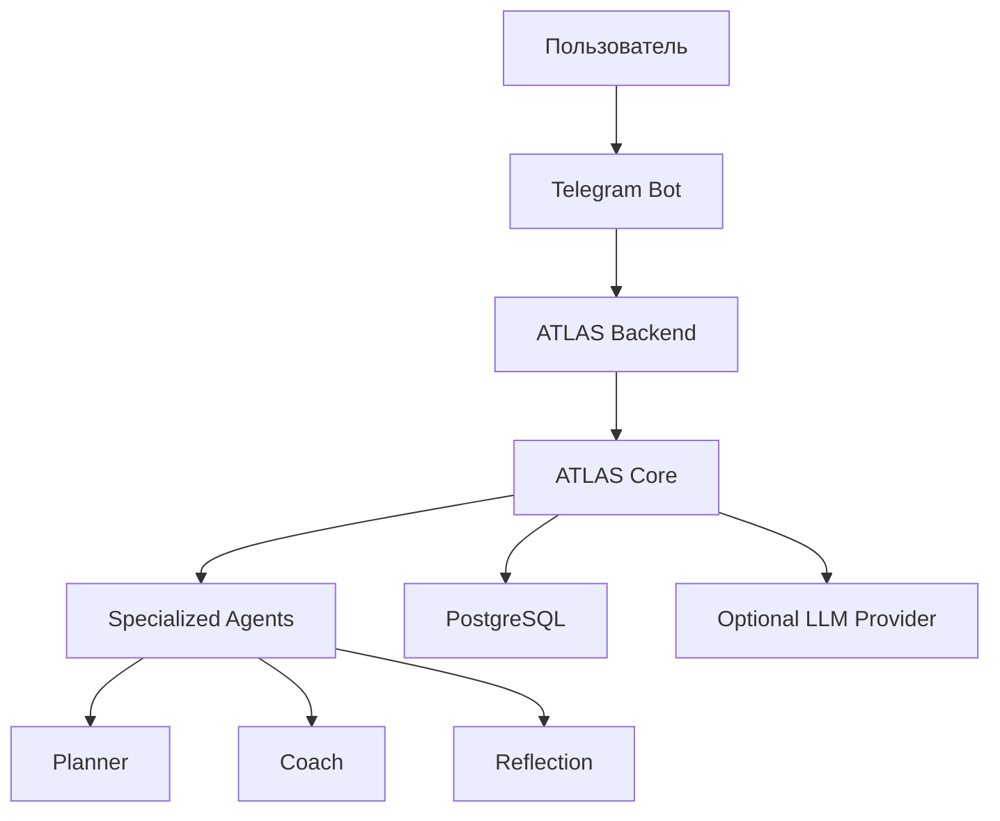

<h1 align="center">ATLAS LifeOps</h1>

<p align="center">
  Экосистема инструментов для состояния, фокуса, привычек, планирования, рефлексии и прогресса.
</p>

<p align="center">
  Telegram-first · Backend-first · LifeOps · Multi-agent architecture
</p>

---

<h2 align="center">О проекте</h2>

**ATLAS LifeOps** — это организация, в рамках которой развивается ATLAS: Telegram-first система для управления повседневной жизнью через одного ассистента.

ATLAS задуман как личный штаб управления жизнью: пользователь взаимодействует с одним Telegram-ботом, а backend маршрутизирует сценарии между специализированными агентами.

Основные направления:

* планирование дня и недели;
* чек-ины и рефлексия;
* привычки и дисциплина;
* фокус и продуктивность;
* тренировки и восстановление;
* питание и состояние;
* недельная аналитика и прогресс.

---

<h2 align="center">Главный репозиторий</h2>

| Репозиторий | Назначение                                                                                                             |
| ----------- | ---------------------------------------------------------------------------------------------------------------------- |
| **ATLAS**   | основной backend-first Telegram-продукт: Spring Boot, PostgreSQL, Telegram Bot API, сценарии, агенты и LLM abstraction |

Основной репозиторий:

```text
github.com/ATLAS-lifeops/ATLAS
```

---

<h2 align="center">Архитектура</h2>



ATLAS строится вокруг идеи расширяемой агентной архитектуры.

Базовые агенты:

| Агент             | Назначение                                         |
| ----------------- | -------------------------------------------------- |
| **ATLAS Core**    | оркестрация, маршрутизация и управление состоянием |
| **ATLAS Planner** | планирование, приоритеты и следующие действия      |
| **ATLAS Coach**   | тренировки, нагрузка и дисциплина                  |

Архитектура позволяет добавлять собственных агентов под новые направления: питание, сон, финансы, обучение, работу, проекты или другие life-ops сценарии.

---

<h2 align="center">Технологический фокус</h2>

<p align="center">
  
  
  
  
  
  
  
</p>

---

<h2 align="center">Статус</h2>

ATLAS находится на ранней стадии активной разработки.

Текущий фокус:

* стабилизация Telegram UX;
* развитие onboarding и conversational flows;
* хранение пользовательских данных;
* LLM abstraction;
* подготовка к LLM-powered agents;
* улучшение документации на русском и английском языках.

---

<h2 align="center">Документация</h2>

Документация основного проекта разделена на русскую и английскую версии:

```text
docs/ru
docs/en
```

Внутри основного репозитория доступны:

* локальный запуск;
* Telegram UX;
* LLM setup;
* changelog;
* production Telegram launch;
* архитектурные заметки.

---

<h2 align="center">Принципы</h2>

ATLAS развивается как:

* backend-first продукт;
* Telegram-first пользовательский интерфейс;
* расширяемая multi-agent система;
* проект с понятным локальным запуском;
* система, которая должна работать даже без обязательного LLM-провайдера;
* основа для будущей персональной life-ops платформы.

---

<h2 align="center">License</h2>

Лицензии определяются на уровне отдельных репозиториев.
